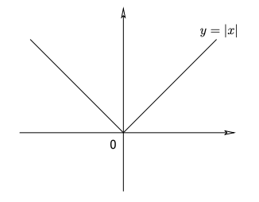

# Examples

https://www.math.univ-toulouse.fr/~rondep/CoursTD/poly4GMM_nondiff.pdf

https://www.youtube.com/watch?v=Bga0Hk2pyzQ>

not differentiable at zero, but if we look at the slope of all tangent line at zero. They form the intervals [-1;1], we anticipate that the sub-differential at 0 is:
$$
\part f(0) = [-1,1]
$$
<u>Proof:</u>

Consider the function
$$
f(x) = |x|,~x \in \R
$$
Then
$$
\part f(0) = [-1,1]
$$
Fix any $v \in \part f(0)$ then by the definition we have the following
$$
\begin{aligned}
 v(x-0) &\le f(x) - f(0),~\forall x \in \R \\
 v  \times x &\le |x|,~\forall x \in \R

\end{aligned}
$$
For $x=1$
$$
v\times 1 = v \le 1
$$
For $x=-1$
$$
v(-1) = -v \le |-1| = 1\\
-1 \le v
$$
Then $v \in [-1,1]$ and hence $\part f(0) \subset [-1,1]$

Let's show the opposite inclusion is also satisfied

Fix any $v \in [-1,1]$ Then
$$
|v| \le 1 \\
\forall x \in \R, \\
v ( x - 0) = v x \le |vx| = |v| |x| \le |x| - |0| = f(x) - f(0)
$$
because a number is always less than its absolute value.

Therefore $v \in \part f(0)$ so $[-1,1] \subset f_0$

----------

Example 2:

Consider the function
$$
f(x) = ||x||, ~~x \in \R^n
$$
then 
$$
\part f(0) = B = {v \in \R^n: ||v|| \le 1}
$$
B is the closed unit ball centered at 0

Fix any $v \in \part f(0)$ then by definition of the subdiff
$$
\langle v, x-0 \rangle \le f(x) - f(0) ~~\forall x \in \R^n \\
\langle v, x\rangle \le ||x||  ~~\forall x \in \R^n \\
$$
For $x=v$
$$
\langle v, x\rangle \le ||x||  \\
||v||^2 \le ||v||\\
$$
This implies $||v|| \le 1$, $v \in B$, thus
$$
\part f(0)\subset B
$$
Let's prove the opposite inclusion, we will fix any B in the closed unit ball and see it is in the sub differential

Fix any $v \in \R^n$ such that $||v|| \le 1$

THen for any $x \in \R^n$ (and by the cauchy schwartz inequality)
$$
\langle v, x-0 \rangle = \langle v, x \rangle \le \underset{\le 1}{||v||}\cdot ||x|| \le ||x|| = f(x) - f(0)
$$
Therefore, $v \in \part f(0)$. Thus the close unit ball B $\subset \part f(0)$

Thus we etablish the formula that 
$$
\part f(0) = B
$$

--------------

Example

Let $

